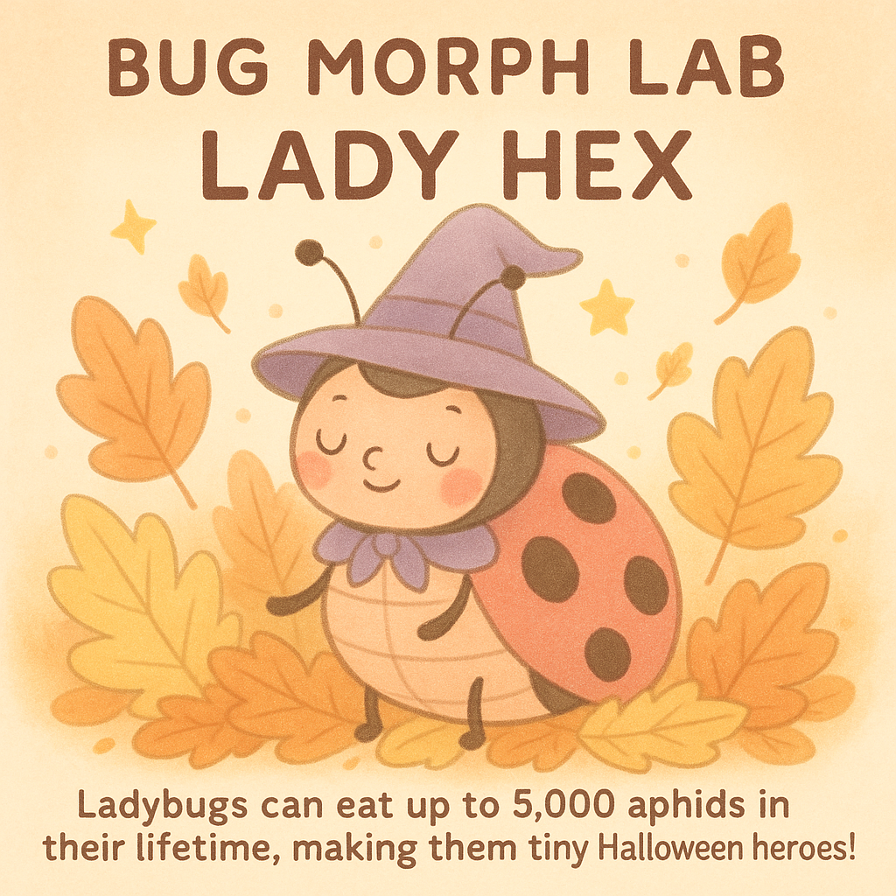

# Bug Morph Lab

**Bug Morph Lab** is an interactive web app that transforms real insect species into creative, AI-generated Halloween characters.
Built with **Streamlit** and **OpenAI’s image generation API**, this project combines entomology, AI, and education to inspire curiosity about biodiversity in a fun, visual way.

---

## Features

* Generate AI illustrations of insects as themed characters (e.g.,Halloween creatures).
* Include creative names, and fun facts.
* Simple web interface powered by Streamlit.
* Encourages STEM learning through art and AI.

---

## Tech Stack

* Python 3.10+
* Streamlit
* OpenAI API
* Pillow, Requests, OS, JSON

---

## Getting Started

### 1. Clone the repository

```bash
git clone https://github.com/Skvalicharla/Bug_Morph_Lab_Insect_Zoo_2025.git
cd Bug_Morph_Lab_Insect_Zoo_2025
```

### 2. Add your OpenAI API key

Create a file named `.env` in the project root and add:

```
OPENAI_API_KEY=your_api_key_here
```

> Important: Make sure `.env` is included in your `.gitignore` file so your API key remains private.

### 3. Run the app

```bash
streamlit run halloween_bugs_app.py
```

---

## File Structure

```
InsectZoo/
│
├── halloween_bugs_app.py  # Main Streamlit app
├── .env                   # Your private API key 
├── .gitignore             # Ignore sensitive and temp files
├── README.md              # Project documentation
└── LICENSE                # MIT License
```

Local folders not tracked by Git: `venv/`, `image_cache/`, `.idea/`

---

## Preview


Example:


> “A ladybug morphed into a witch with a tiny hat.”

---

## License

Licensed under the MIT License – see the [LICENSE](./LICENSE.txt) file for details.

---

## Acknowledgements

* OpenAI — for image generation
* Streamlit — for the web app framework
* Inspired by real-world entomology and curiosity-driven learning
